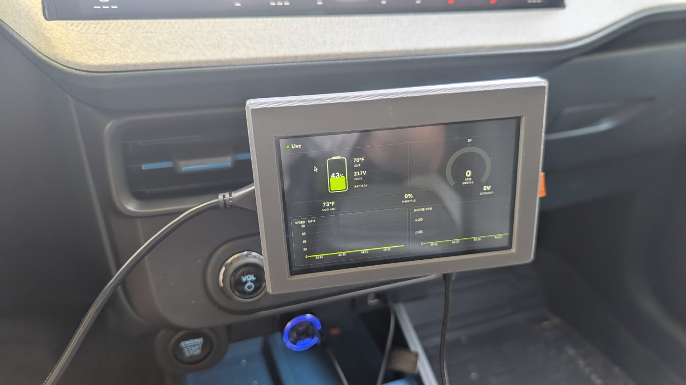

# Maverick Telemetry Hub

> An offline-first, AI-enhanced vehicle telemetry system built for a 2026 Ford Maverick Hybrid — running on a Raspberry Pi 5, mounted in the cab.


---

## In the car



*5" touchscreen mounted in the cab — the live view: hybrid battery SOC, pack temp and voltage, coolant, throttle, engine RPM, and rolling speed/RPM traces.*

---

## Dashboard


*Trip history with MPG, average speed, and DTC badge for any trip with fault codes.*


*Per-trip detail: summary stats, AI-interpreted fault code (P0D0B diagnosed by Claude), and trip notes.*

---

## What this is

A full-stack edge telemetry system that reads live OBD-II data from a 2026 Ford Maverick Hybrid, processes it locally on a Raspberry Pi 5, and persists every trip to a local SQLite database — with no cloud dependency.

After each drive, a React dashboard served over local WiFi provides post-trip analysis: speed and RPM traces, fuel economy stats, and trip history. An AI layer interprets any OBD-II fault codes (DTCs) in plain English using the Claude API. Results are cached in SQLite — the API is called once per code, never again.

The system powers on automatically with the ignition and requires no interaction to begin logging. New builds deploy themselves over the air from GitHub Releases — the Pi never needs to be plugged into a keyboard or reached over SSH.

---

## Architecture

```
2026 Maverick Hybrid (OBD-II)                    Jetson Orin Nano (dashcam + vision)
        |                                          |
   OBDLink EX (USB)                           camera ──┬── H.264 encode → splitmuxsink
        |                                              │      (1080p30 fMP4 segments)
   Raspberry Pi 5  ◄────── ethernet 192.168.100.x ─────┤
   ├── obd_poller.py      polls sensors at 1Hz         └── appsink → YOLO speed-limit signs
   ├── trip_manager.py    detects ignition on/off              |
   ├── crash_detector.py  hard-stop / crash detection          ├── recorder.py    retention + protection
   ├── db_writer.py       MQTT → SQLite (only writer)          └── clip_server.py read-only HTTP + Range
   └── server/
       └── index.js       Express + WebSocket bridge, serves React dashboard
              |            ...and range-proxies dashcam video from the Jetson
        React Dashboard (client/)  →  Tauri app on the in-cab display
        ├── Live view     real-time gauges + rolling D3 charts
        ├── Trip list     history with summary stats
        ├── Trip detail   per-trip traces, stats, DTCs, dashcam footage, notes
        └── Diagnostics   fault codes + dashcam storage
              |
        Claude API        DTC fault code interpretation
```

### Where the footage lives

Video stays on the Jetson — it has the disk (937 GB NVMe), and a month of 1080p
is far more than the Pi should carry. SQLite holds only clip metadata and the
trip linkage; the Express bridge range-proxies the bytes on demand, so the
browser streams from the Pi's origin and never learns the Jetson exists. Video
bytes never touch MQTT.

### A note on encoding: the Orin Nano has no NVENC

Verified on the hardware — the `nvvideo4linux2` plugin registers exactly one
element (`nvv4l2decoder`) and there is no `/dev/nvhost-msenc`. The Jetson Orin
Nano SKU ships **without a video encoder**; it can decode in hardware but not
encode. Measured on this board at 15 W, 1080p30:

| Path                        | Throughput      |
| --------------------------- | --------------- |
| Camera H.264 passthrough    | no encode at all |
| `openh264enc` 1080p30       | 1.5× realtime   |
| `x264enc` 1080p30 ultrafast | **0.65× realtime — cannot keep up** |
| `x264enc` 720p30            | 1.5× realtime   |

So `recorder.py` tries a **camera that encodes H.264 onboard first** — that path
re-encodes nothing, leaves the CPU free for everything else, and lets the
inference branch use the hardware decoder the board *does* have. Most UVC
webcams (Logitech C920/C922 and similar) do this. Failing that it falls back to
`openh264enc`, which keeps up at 1080p30 but competes with YOLO for the CPU.

### Process isolation

Each Python process has a single responsibility and communicates only via MQTT. The Express bridge is the only process that reads SQLite. `db_writer.py` is the only process that writes to it. If any process crashes, systemd restarts it independently without affecting the others.

### Power-loss recovery

When the engine cuts power to the Pi mid-trip, processes die without a clean shutdown — `trip_manager` never publishes `trip_close`, so the trip stays open in the database with no summary. On next boot, `db_writer` automatically recovers any unclosed trips: it sets `ended_at` to the last committed reading's timestamp, computes duration, and generates the trip summary from whatever readings were saved. No manual intervention needed.

---

## Features

- **Dashcam** — continuous 1080p30 H.264 recording on the Jetson, tee'd off the same camera that runs sign detection. Segments are fragmented MP4: measured on the device, a clip killed mid-write still yields 13 of its 15 seconds, where a plain MP4 yields nothing. Roughly 30 days of rolling retention, bounded by age and a byte budget.
- **Crash detection** — a hard deceleration on the OBD speed stream raises an event. `hard_brake` is logged for threshold calibration; a `potential_crash` (violent decel *and* an actual stop) keeps that trip's footage indefinitely, exempt from the purge until deleted by hand.
- **Footage in the dashboard** — per-trip video with seeking (HTTP Range all the way through), per-clip and bulk delete behind a confirm dialog, and a storage readout on the Diagnostics page.
- **Automatic trip detection** — opens a trip on ignition on (RPM > 10), closes after 5 minutes of zero RPM or OBD disconnect. Accounts for Maverick Hybrid EV stops at red lights.
- **1Hz sensor logging** — RPM, speed, coolant temp, throttle position, fuel rate, and HV battery SOC / pack temperature / pack voltage written to SQLite every second.
- **Post-trip dashboard** — React UI served over local WiFi. Trip history, speed and RPM traces, MPG, and per-trip notes.
- **Live in-cab view** — real-time gauges (including a hybrid battery gauge: SOC, pack temp, EV mode, regen) and 5-minute rolling charts via WebSocket. Designed for glanceable display while driving.
- **AI fault code interpreter** — DTCs sent to Claude for plain-English diagnosis with urgency assessment. Results cached in SQLite.
- **Native Tauri display** — the dashboard runs as a Tauri app (WebKitGTK) rather than a Chromium kiosk. Eliminates a full browser process, meaningfully reducing CPU load and heat in a thermally constrained cab environment.
- **Over-the-air self-update** — the Pi polls GitHub Releases every 2 minutes and applies new Tauri binaries and React builds itself, then restarts the affected services. The dashboard shows the running version and offers a one-tap update when a newer release is available. Outbound HTTPS to GitHub only — no inbound SSH, no self-hosted runner.
- **Version-controlled display** — the DSI panel's rotation and mode (including upside-down install) live in `deploy/kanshi.config` and are reapplied on every deploy, so the screen orientation survives a reimage.
- **Offline-first** — core telemetry runs with zero network dependency. AI and self-update features degrade gracefully without connectivity.
- **Power-loss resilient** — trip data is committed reading-by-reading; unclosed trips are recovered automatically on reboot.

---

## Hybrid PID discovery

The 2026 Maverick Hybrid's high-voltage battery data isn't exposed through standard OBD-II PIDs — it lives behind Ford proprietary Mode 22 PIDs with no public documentation. The PIDs were surfaced another way: using the Claude API to systematically probe the vehicle's ECUs, querying Mode 22 across candidate modules and validating the responses against expected values until the BECM PIDs reporting real hybrid data were identified and confirmed. The dashboard now reads live, validated hybrid telemetry.

Confirmed BECM Mode 22 PIDs on the Maverick FHEV: battery SOC (DID 4801), pack temperature (DID 4808), pack voltage (DID 480D).

---

## Hardware

| Component      | Details                                                       |
| -------------- | ------------------------------------------------------------- |
| Edge computer  | Raspberry Pi 5 (4GB)                                          |
| Storage        | Raspberry Pi M.2 HAT+ with WD SN740 M.2 2230 NVMe (256GB)     |
| OBD-II adapter | OBDLink EX (USB)                                              |
| Display        | Hosyond 5" IPS Capacitive Touchscreen, 800×480, MIPI DSI      |
| Enclosure      | Custom PETG, designed in Fusion 360                           |
| Mount          | Glued magnetic ring → standard air-register phone mount       |
| Power          | Auxiliary power outlet (12V), ignition-switched               |

The magnetic ring on the back of the enclosure mates with any standard magnetic phone holder, making the unit trivially relocatable and not tied to one vehicle's trim.

---

## Tech stack

| Layer            | Technology                                    |
| ---------------- | --------------------------------------------- |
| Sensor polling   | Python, python-obd                            |
| Message broker   | MQTT (Mosquitto)                              |
| Trip management  | Python state machine                          |
| Database         | SQLite (WAL mode, versioned migrations)       |
| Backend / bridge | Node.js, Express, WebSockets, better-sqlite3  |
| Frontend         | React 19, TypeScript, Vite, Tailwind CSS v4   |
| Display runtime  | Tauri 2 (WebKitGTK — replaces Chromium kiosk) |
| Compositor       | labwc + kanshi (Wayland) on Raspberry Pi OS   |
| Charts           | D3                                            |
| AI integration   | Claude API (claude-sonnet-4-6)                |
| Self-update      | GitHub Releases + systemd timer (pull-deploy) |

---

## Repository structure

```
maverick-telemetry-hub/
├── db/
│   ├── migrate.py              SQLite schema + versioned migrations
│   └── seed.sql                Development seed data
├── obd_poller.py               OBD-II sensor polling process
├── trip_manager.py             Trip lifecycle state machine
├── crash_detector.py           Hard-brake / crash detection from OBD speed
├── db_writer.py                MQTT subscriber → SQLite writer (with boot recovery)
├── jetson/
│   ├── vision_publisher.py     Camera owner: inference + dashcam publishing
│   ├── camera.py               Frame-source arbiter (recorder → cv2 → test pattern)
│   ├── recorder.py             GStreamer tee, H.264 encode, segmenting
│   ├── clipstore.py            On-disk clip layout, protection, retention pruner
│   ├── clip_server.py          Read-only HTTP + Range server for footage
│   ├── classifier.py           Temporal gating for detections
│   └── speed_limit_model.py    Two-stage YOLO speed-limit inference
├── server/
│   ├── index.js                Express entry point
│   ├── mqtt.js                 MQTT client, subscriptions, command publishing
│   ├── websocket.js            WebSocket server and broadcast
│   ├── db.js                   SQLite connection
│   ├── version.js              GitHub release polling + current build
│   └── routes/
│       ├── trips.js            Trip list, detail, readings, videos, crash events
│       ├── videos.js           Dashcam clips + range proxy to the Jetson
│       ├── dtcs.js             Fault code endpoints + Claude diagnosis
│       └── version.js          Version status + self-update trigger
├── client/                     React dashboard (Vite + Tailwind v4 + Tauri 2)
├── docs/                       Screenshots and photos
├── deploy/                     systemd units, kiosk + display config, OTA scripts
│   └── README.md               Deployment guide (install, kiosk, OTA, troubleshooting)
└── README.md
```

See [deploy/README.md](deploy/README.md) for the full contents of `deploy/`.

---

## API reference

| Method | Endpoint                        | Description                                          |
| ------ | ------------------------------- | ---------------------------------------------------- |
| GET    | `/api/trips`                    | All trips, most recent first, with summary stats     |
| GET    | `/api/trips/:id`                | Single trip with summary                             |
| GET    | `/api/trips/:id/readings`       | All sensor readings for a trip                       |
| GET    | `/api/trips/:id/dtcs`           | Fault codes for a trip                               |
| GET    | `/api/trips/:id/vision`         | Jetson vision snapshots for a trip                   |
| GET    | `/api/trips/:id/videos`         | Dashcam clips for a trip                             |
| GET    | `/api/trips/:id/crash-events`   | Hard-brake / potential-crash events for a trip       |
| DELETE | `/api/trips/:id/videos`         | Delete a trip's footage (`?force=1` if protected)    |
| POST   | `/api/trips/:id/videos/protect` | Protect / release footage — `{ protected: boolean }` |
| GET    | `/api/videos`                   | All clips (`?trip_id=` / `?unassigned=1`)            |
| GET    | `/api/videos/:clipId/stream`    | Video stream, range-proxied from the Jetson          |
| DELETE | `/api/videos/:clipId`           | Delete one clip (`?force=1` if protected)            |
| DELETE | `/api/videos/unassigned`        | Delete footage that matched no trip                  |
| GET    | `/api/dashcam/status`           | Clip counts, storage use, Jetson disk + record state |
| GET    | `/api/dtcs`                     | All fault codes across all trips                     |
| POST   | `/api/dtcs/:id/diagnose`        | Fetch Claude diagnosis for a DTC (cached)            |
| GET    | `/api/version`                  | Current build, latest release, update-available flag |
| POST   | `/api/version/update`           | Apply the latest release (runs the OTA self-update)  |
| GET    | `/api/health`                   | Server health + MQTT / vision / dashcam status       |

Deletes answer **202, not 200**. Express is not allowed to write SQLite (single-writer
invariant) or to touch the Jetson's files, so a delete publishes an MQTT command:
`db_writer` marks the row `pending_delete`, the Jetson unlinks the file and confirms,
and only then does the row disappear.

A WebSocket on the same port streams live telemetry to the dashboard's in-cab view.

---

## Database schema

`trip_summaries` is computed once on trip close (or on boot recovery) — never recalculated at query time.

```
trips           one row per ignition cycle
readings        raw 1Hz sensor stream, foreign key → trips
dtcs            fault code events, foreign key → trips
trip_summaries  aggregated stats, 1:1 with trips
vision_frames   Jetson snapshots, foreign key → trips
dashcam_clips   video segment metadata (files live on the Jetson)
crash_events    hard-brake / potential-crash events
```

`dashcam_clips.trip_id` is **nullable**, unlike every other table. Recording runs
whenever the Jetson is powered, so a clip can legitimately fall outside any trip;
dropping those would strand files on disk the dashboard could neither show nor
delete, so they are kept and surfaced as unassigned footage instead.

Migration versions:

- **v1** — base schema (trips, readings, dtcs, trip_summaries)
- **v2** — adds `pack_voltage_v`, `battery_current_a`, `motor_speed_rpm` to readings (Ford Mode 22 hybrid PIDs)
- **v3** — adds `hvb_temp_f` to readings (HV pack temperature, Ford BECM Mode 22 DID 4808)
- **v4** — adds `vision_frames` (Jetson snapshots)
- **v5** — adds `dashcam_clips` and `crash_events`, plus `crash_count` / `footage_protected` on trips

---

## MQTT topic map

| Topic                              | Publisher          | Description                          |
| ---------------------------------- | ------------------ | ------------------------------------ |
| `maverick/telemetry/reading`       | obd_poller         | Raw sensor reading, 1Hz              |
| `maverick/telemetry/poller_status` | obd_poller         | OBD connection state                 |
| `maverick/telemetry/trip_open`     | trip_manager       | Trip started                         |
| `maverick/telemetry/trip_close`    | trip_manager       | Trip ended                           |
| `maverick/telemetry/dtc`           | obd_poller         | Fault code detected                  |
| `maverick/telemetry/crash_event`   | crash_detector     | Hard brake / potential crash         |
| `maverick/vision/status`           | vision_publisher   | Jetson liveness heartbeat            |
| `maverick/vision/frame`            | vision_publisher   | Confirmed detection + JPEG           |
| `maverick/vision/scene`            | vision_publisher   | Lightweight twin of `/frame`         |
| `maverick/dashcam/clip`            | vision_publisher   | One closed video segment's metadata  |
| `maverick/dashcam/status`          | vision_publisher   | Recording state + storage counters   |
| `maverick/dashcam/pruned`          | vision_publisher   | Clips the retention pruner deleted   |
| `maverick/dashcam/command`         | bridge, db_writer  | delete / protect / unprotect         |
| `maverick/dashcam/command_result`  | vision_publisher   | Confirmation of a command            |

**Dashcam topics carry metadata only, never video bytes.** The bridge subscribes to
`maverick/dashcam/status` explicitly and must never be widened to
`maverick/dashcam/#` — everything it subscribes to is rebroadcast to every WebSocket
client and held 500-deep in a ring buffer. The same rule already keeps
`maverick/vision/frame` out.

### Trips have no id on the wire

`trips.id` is minted by `db_writer` from `cursor.lastrowid` and is never published,
and `trip_open` is not retained — so the Jetson cannot know which trip is running.
Clips are published with timestamps only, and `db_writer` resolves the trip by
**timestamp overlap** (with a 60s lead and 5min trail for the RPM threshold and the
zero-RPM close timeout). That also makes backfill correct: when the Jetson reconnects
after a cable drop and flushes queued segments, each lands on the trip it was filmed
during rather than whichever trip happens to be open at delivery time.

---

## Self-update (OTA)

The Pi keeps itself current without any inbound access. A `systemd` timer runs `deploy/pull-deploy.sh` every 2 minutes; it polls the GitHub Releases API, and when a new tag appears it downloads the release's Tauri binary and React build, refreshes the Python/server files from `git`, runs any pending database migrations, and restarts the Express bridge and kiosk. The dashboard's version badge surfaces the same check to the driver and can trigger an update on demand via `POST /api/version/update`.

Because the flow is pull-based, the only network requirement is outbound HTTPS to GitHub — there is no open SSH port and no self-hosted CI runner on the vehicle. Setup details (timer, optional GitHub token, passwordless `systemctl restart` sudoers entry) are in [deploy/README.md](deploy/README.md).

---

## Project status

The system is built, installed, and running on real hardware in the vehicle (current build: **v1.0.0**).

- [x] SQLite schema and migration script
- [x] `obd_poller.py` — sensor polling with reconnect backoff
- [x] `trip_manager.py` — ignition detection state machine
- [x] `db_writer.py` — MQTT → SQLite with retry logic and boot recovery
- [x] systemd service files for all processes
- [x] Express bridge — REST API + WebSocket server
- [x] React dashboard — trip list, trip detail, sensor charts
- [x] Tauri display — fullscreen on MIPI DSI (replaced Chromium kiosk; resolved thermal throttling)
- [x] Claude API DTC interpreter — plain-English fault code diagnosis
- [x] Live WebSocket view — real-time gauges and rolling charts
- [x] Ford hybrid PID discovery — BECM Mode 22 PIDs polled live: battery SOC (DID 4801), pack temp (4808), pack voltage (480D) on Maverick FHEV
- [x] Derived EV mode / regen power from HV current (BECM Mode 22, DID 48FB) on Maverick FHEV
- [x] Over-the-air self-update — pull-based deploy from GitHub Releases + in-dashboard version badge
- [x] Version-controlled display rotation (kanshi) — including upside-down install
- [x] Fusion 360 PETG enclosure — designed, printed, and mounted
- [x] M.2 HAT+ storage migration — running off NVMe
- [x] In-vehicle install — air-register phone mount + glued magnetic ring
- [x] Jetson dashcam — 1080p30 fragmented MP4, tee'd off the sign-detection camera
- [ ] Camera — **none is currently attached**; a UVC model with onboard H.264 is strongly preferred (see below)
- [x] Retention — 30-day rolling purge bounded by age and byte budget, protected footage exempt
- [x] Crash detection — hard-brake and potential-crash events from the 1Hz OBD speed stream
- [x] Footage in the dashboard — per-trip playback with seeking, manual delete, storage readout
- [ ] On-vehicle validation of the recording pipeline (camera format, disk headroom, NVENC)
- [ ] Crash-threshold calibration against real `hard_brake` data

---

## Setup

The full installation, kiosk, display, and over-the-air update setup lives in **[deploy/README.md](deploy/README.md)**.

Once deployed, the dashboard is available at `http://<pi-ip>:3000` from any device on the same WiFi network, and runs fullscreen as a Tauri app on the in-cab display.

For local development:

```bash
# Backend bridge
cd server && npm install && npm start        # serves on :3000

# Frontend (Vite dev server)
cd client && npm install && npm run dev
```

---

## Why I built this

My professional background is in offline-first edge and kiosk applications and real-time, WebSocket-driven vehicle diagnostics. I wanted a project that combined that experience with a real hardware boundary on a vehicle I actually drive — using hardware I own, and producing something genuinely useful rather than a contrived demo.

The 2026 Maverick Hybrid presented an interesting challenge: standard OBD-II PIDs cover engine vitals, but hybrid-specific data (battery SOC, pack temperature, pack voltage) lives behind Ford proprietary Mode 22 PIDs with no public documentation. Community forums turned up nothing usable, so I surfaced them another way — using the Claude API to systematically probe the vehicle's ECUs, query Mode 22 across candidate modules, and validate responses against expected values until the BECM PIDs reporting real hybrid data were identified and confirmed.

---

## Author

Alex Tsuker
[GitHub](https://github.com/AlexTs-dev) · [LinkedIn](https://www.linkedin.com/in/alex-t-5a5b1b3a7)

---

## License

MIT
